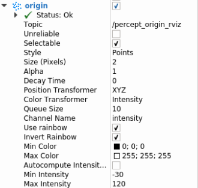

# rivz显示配置说明

>Author : Perception Group
>
>Time : 2021.06.10


rviz的配置在rs_sdk/config/system_config/perception_config/rs_perception.yaml中。

pub_cloud_keys控制需要显示的点云，有6种点云可以显示，分别为原始点云、地面点、背景点、非地面点、聚类点和语义分割点，当不需要显示什么点云时注释该类别便可取消显示。

pub_marker_keys控制需要显示的目标信息。一共有19种可以选择，具体含义请见配置表注释。当不需要显示某些项目时直接注释掉该类别便可取消显示。

```bash
#* Rviz *#
rviz:
  prefix: "" # DEFAULT
  strategy: "EFFICIENT" #DEFAULT "EFFICIENT","ORIGIN"
  map:
    - "" #DEFAULT address file for map
    - "" #DEFAULT address file for map
  road:
    - "" #DEFAULT
  frame_id: "/base_link" #DEFAULT
  map_frame_id: "/map" #DEFAULT
  pub_cloud_keys:
    - "origin"   # 原始点云
    - "ground"   # 地面点云
    - "background"  # 背景点点云
    - "non_ground"  # 非地面点点云
    - "clusters"  # 聚类点点云
    - "sematic"  # 语义分割点云
  pub_marker_keys:
#    - "acc_dir"  # 目标加速度方向
#    - "atten"  # 非AI一度目标朝向自车的平面
    - "barrier"  # 栅栏
    - "box_infos"  # AI目标的box信息，包括距离、框大小
    - "box_lines"  # AI目标的box线框
    - "cube"  # AI目标的box框
    - "cylinder"  # 行人的圆柱体
    - "cylinder_lines"  # 行人的圆柱体线框
#    - "freespace"  # freespace
#    - "gps"  # GPS信息
    - "label_infos"  # AI目标的label信息，分类的种类大车、小车、自行车、行人或锥桶
#    - "lane"  # 车道线
    - "polygon"  # AI目标的polygon
    - "atten_polygon"  # 非AI一度目标的polygon，若开启barrier检测，则不显示barrier的polygon
    - "atten_label"  # 非AI一度目标的label，如果有barrier检测，则会标识从出是unknown还是barrier，若没有开启barrier检测则一度目标都为unknown
#    - "roadedge"  # 路沿
    - "track_infos"  # AI目标的跟踪信息，包括所处车道线位置、track id和速度信息
#    - "trajectory"  # AI目标的跟踪轨迹
#    - "vel_dir"  # AI目标的速度方向
```

除了以上信息可以配置感知输出的信息之外，也可以在打开rviz之后在perception下的namespace进行选择配置。

针对smartsensor的多数客户我们需要显示的信息有：

```bash
pub_cloud_keys**：
"origin"  # 原始点云

**pub_marker_keys**
"barrier"  # 栅栏
"box_lines"  # AI目标的box线框
"cube"  # AI目标的box框
"cylinder"  # 行人的圆柱体
"cylinder_lines"  # 行人的圆柱体线框
"freespace"  # freespace
"label_infos"  # AI目标的label信息，分类的种类大车、小车、自行车、行人或锥桶
"atten_polygon"  # 非AI一度目标的polygon，若开启barrier检测，则不显示barrier的polygon
"atten_label"  # 非AI一度目标的label，如果有barrier检测，则会标识从出是unknown还是barrier，若没有开启barrier检测则一度目标都为unknown
```

点云的默认配置为：

